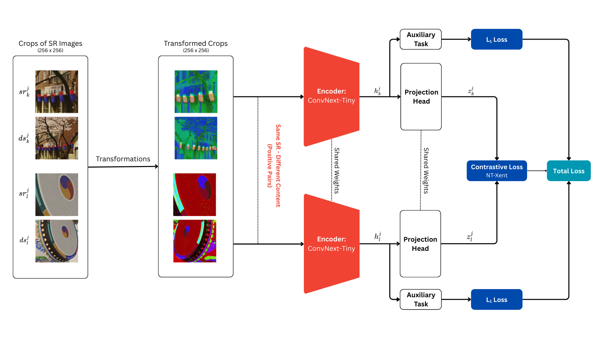

## Self-Supervised Image Super-Resolution Quality Assessment based on Content-Free Multi-Model Oriented Representation Learning

[[Paper (preprint)- arXiv](http://arxiv.org/abs/2602.10744)] 
[[Dataset - Zenodo](https://zenodo.org/records/18479156)] 

<p align=center>
   <br/>
</p>

### Overview
This repository provides source code, dataset, and material associated for our 2026 paper titled "Self-Supervised Image Super-Resolution Quality Assessment based on Content-Free Multi-Model Oriented Representation Learning." Our paper proposes the first self-supervised learning approach to assess the quality of super-resolution images generated from real low-resolution inputs. S3RIQA outperforms no-reference SR-IQA metrics in existing benchmarks using multiple SR-IQA datasets, with realistic LR images.


### Authors
- Kian Majlessi
- Amir Masoud Soltani
- Mohammad Ebrahim Mahdavi
- Aurelien Gourrier
- Peyman Adibi

### Citation
If you find this project useful, then please consider citing both our paper and dataset.

```bibtex
@article{majlessi2026s3riqa,
  title={Self-Supervised Image Super-Resolution Quality Assessment based on Content-Free Multi-Model Oriented Representation Learning},
  author={Majlessi, Kian and Soltani, Amir Masoud and Mahdavi, Mohammad Ebrahim and Gourrier, Aurelien and Adibi, Peyman},
  journal={arXiv preprint arXiv:2602.10744},
  year={2026}
}

@dataset{majlessi2026srmorss
  title={SRMORSS: Super-Resolution Model-Oriented Realistic Self-Supervision Dataset},
  author={Majlessi, Kian and Soltani, Amir Masoud and Mahdavi, Mohammad Ebrahim and Gourrier, Aurelien and Adibi, Peyman},
  publisher={Zenodo},
  version={1.0.0},
  url={https://doi.org/10.5281/zenodo.18479156},
  doi={10.5281/zenodo.18479156},
  year={2026},
}
```

### Code Setup
Coming Soon!

### Source Code License 

[](./LICENSE)

### Dataset License

[](https://creativecommons.org/licenses/by-nc-sa/4.0/)

### Acknowledgments
This work has benefited from a French government grant managed by the Agence Nationale de la Recherche under the France 2030 program, reference ANR-23-IACL-0006.
